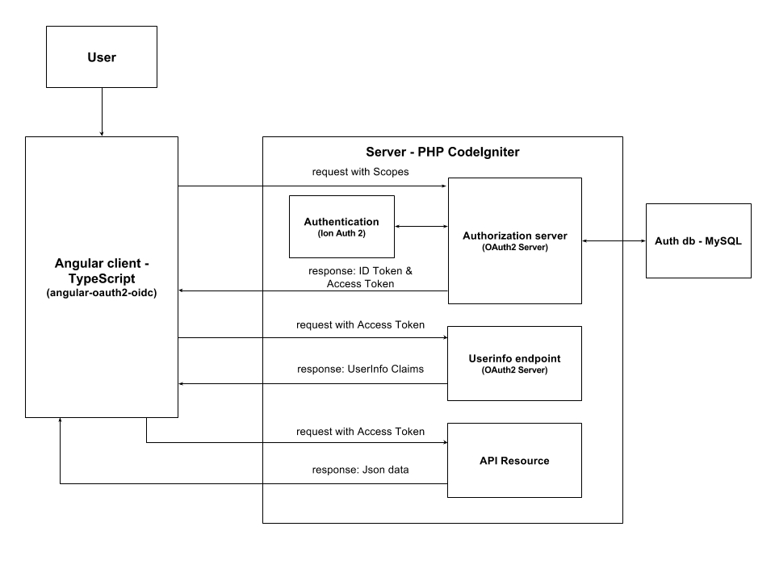
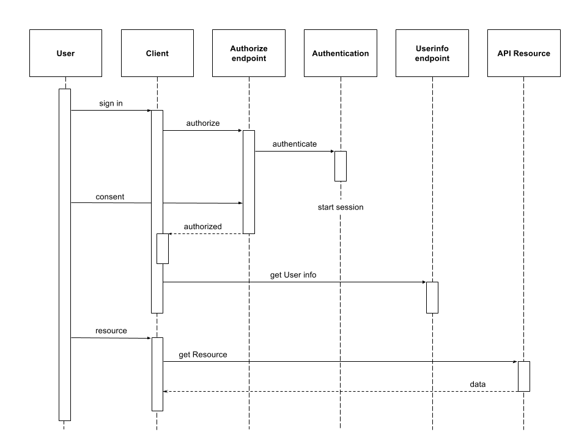

# Angular OpenID Connect PHP

> **Angular 2+** & PHP CodeIgniter server through OAuth 2.0 OpenID Connect. The OAuth 2.0 OpenID Connect implicit flow is implemented using angular-auth-oidc-client and OAuth 2.0 Server PHP. CodeIgniter Ion Auth 2 is used as authentication system.

Get the [Changelog](https://github.com/robisim74/angular-openid-connect-php/blob/master/CHANGELOG.md).

The purpose of this project is to implement a client app built with Angular 2+ that, through OAauth2 OpenID Connect implicit flow, communicates safely with an API server in PHP. The API server in this project is also the Authorization server, but they could also be on two different servers.

In the Angular app, the OIDC implicit flow is implemented using the library certified by OpenID Foundation [angular-auth-oidc-client](https://github.com/damienbod/angular-auth-oidc-client)

Server side, the OIDC implicit flow is implemented using [OAuth 2.0 Server PHP](https://bshaffer.github.io/oauth2-server-php-docs/)

As PHP framework is used [CodeIgniter](https://codeigniter.com/), and [Ion Auth 2](https://github.com/benedmunds/CodeIgniter-Ion-Auth) as authentication system. The CodeIgniter extensions used are [Modular Extensions - HMVC](https://bitbucket.org/wiredesignz/codeigniter-modular-extensions-hmvc) and [Rest Server](https://github.com/chriskacerguis/codeigniter-restserver) for the API.

However, you can adapt this implementation of OpenID Connect to other frameworks: you only need MVC pattern, routing, and authentication system: the files to be adapted are marked with an asterisk in the following structure.

## Project structure
**angular-client** _Angular app_

**server** _PHP CodeIgniter server_
- **application** _CodeIgniter app_
	- **libraries**
    	- **OAuth2_server.php** _OAuth 2.0 Server PHP configuration_*
	- **modules** _HMVC modules_
        - **admin** _Admin panel_ 
        - **api** _restServer APIs_
        - **connect** _OpenID connect endpoints_*
        - **well_known** _OpenID connect discovery document_*
- **data** _sql files_
	- **ion_auth.sql** _Schema for Ion Auth 2_
    - **oauth2.sql** _Schema for OAuth2 Server_

## Architecture
The following component and sequence diagrams show the architecture and the behavior of the project.

#### Component diagram

#### Sequence diagram

After the user has been authorized, requests are sent through _iframe_ and at regular intervals to _Checksession_ endpoint to verify that the user is always logged in the Authorization server.
On the expiration of the Access token (after 15 minutes in this project), a new token is automatically prompted to the Authorization server via _silent renew_.

## Installing
- **Requirements**
	- PHP version 5.6 or newer
	- MySQL (5.1+), mysqli and pdo drivers
    - Apache Module `mod_rewrite` enabled
    - Composer
    - Latest Node.js & [npm](https://docs.npmjs.com/troubleshooting/try-the-latest-stable-version-of-npm)
    - Latest [Angular CLI](https://github.com/angular/angular-cli)
- Download this project and extract it on your Apache server
- Server
	- Create a MySQL `auth_db`
    - Import the sql files from `data` folder
    - Check the db configuration in `application/config/database.php`
    - Check the `base_url` configuration in `application/config/config.php`
    - Go to `[path]/server/application`: `composer install`
    - Go to `[path]/server/public/assets`: `npm install`
    - Start your server
- Angular client
    - Optional: you can move the client wherever you want
    - Check the `angular-auth-oidc-client` configuration in `[path]/angular-client/src/app/app.module.ts`
    - Go to `[path]/angular-client`: `npm install`
    - Start the app: `ng serve` and visit `http://localhost:4200`

You can also access directly to the simple Admin panel on the Authorization server: `http://localhost/angular-openid-connect-php/server`

Initially, there is only the admin user:
- **username/email**: `admin@admin.com`
- **password**: `password`

## Live example
A live demo of the project is also available. For convenience, both the Angular client and the PHP server are deployed on the same server (the second one is in a subdirectory).

- Angular client: http://angular-oidc-php.infinityfreeapp.com
- PHP server: http://angular-oidc-php.infinityfreeapp.com/server

## Links
- [The OAuth 2.0 Authorization Framework - Implicit Grant](https://tools.ietf.org/html/rfc6749#section-4.2)
- [OpenID Connect Core 1.0](http://openid.net/specs/openid-connect-core-1_0.html)
- [OpenID Connect Implicit Client Implementer's Guide 1.0](http://openid.net/specs/openid-connect-implicit-1_0.html)
- [OpenID Connect Discovery 1.0](http://openid.net/specs/openid-connect-discovery-1_0.html)
- [OpenID Connect Session Management](http://openid.net/specs/openid-connect-session-1_0.html)

## License
MIT
